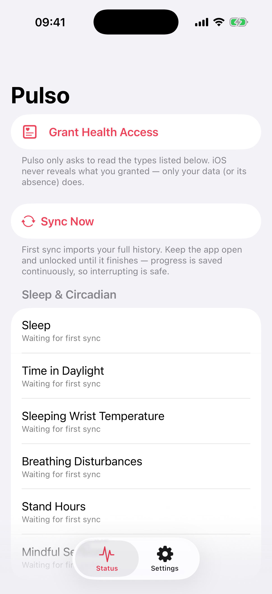
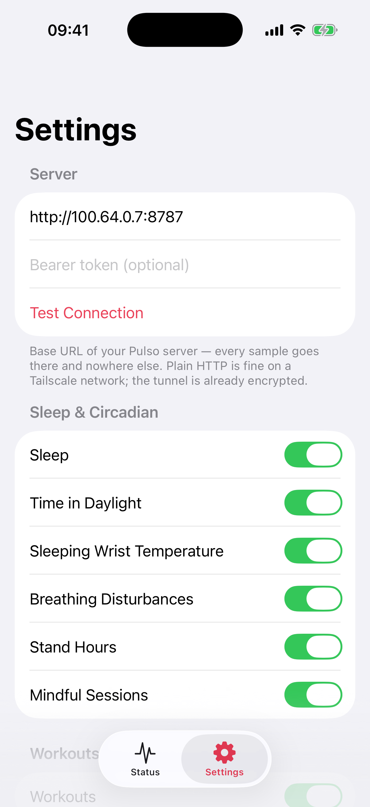

# Pulso

**Continuously deliver your Apple Health data to a server you own.**

Pulso is an open-source iOS app with one job: read the Apple Health data you
select and ship it — incrementally, in the background, surviving crashes and
outages — to an HTTP endpoint you configure. Self-hosted personal telemetry.

<p align="center">
  
  &nbsp;&nbsp;
  
</p>

## Privacy model (read this first)

- All data flows **device → your server**. There is no cloud, no account, no
  analytics, no telemetry, and no third-party code (zero dependencies).
- The app makes exactly **two kinds of network calls**, both to the server
  you configure: `POST /ingest` (your health samples) and `GET /health` (the
  "Test Connection" button). Nothing else, ever.
- Pending data on the device is excluded from device backups.
- The optional bearer token is stored in the iOS Keychain.

## Why it exists

Apple Health has no API. The data lives in an encrypted on-device store that
only a native iOS app can read, with per-type user consent. One-shot exports
are manual, huge, and instantly stale; Shortcuts can't read workouts at all
and takes tens of minutes for a few thousand samples. If you want your sleep
and workouts available to your own tools (say, AI agents on your Mac)
continuously, a dedicated app is the only honest path. This is that app.

## How it works

```
HealthKit ──anchored queries──► SyncEngine ──batches──► Outbox (disk) ──HTTP──► your server
                 ▲                                          │
   observer / BGTask / foreground triggers            retry w/ backoff
```

- **Anchored queries** (`HKAnchoredObjectQuery`) are the sync cursor: each
  pass returns exactly the new samples and deletions since the last anchor —
  rewrites and late backfills from other apps included.
- **The outbox** writes every batch to disk *before* the first upload
  attempt and deletes it only on a server 2xx. **The anchor advances only
  when the server ACKs.** Crash anywhere and the worst case is a re-send,
  which the server dedupes by sample uuid.
- **Triggers**: HealthKit background delivery (immediate for sleep and
  workouts, hourly for the rest), an opportunistic `BGAppRefreshTask`, and a
  full sync every time you open the app.

**Honest expectations:** iOS does not run daemons, and health data is
unreadable while the phone is locked. In practice, sleep data lands on your
server within minutes of picking up the phone in the morning. That is the
ceiling on iOS, and it's good enough.

### Synced types

57 types across eight groups: sleep & circadian (sleep stages, daylight
time, wrist temperature, breathing disturbances, stand hours, mindfulness),
workouts (with full metadata and heart-rate statistics), energy & activity,
cardio & recovery, body composition, running & gait form, audio exposure,
and nutrition. The complete list with units lives in
[`docs/PROTOCOL.md`](docs/PROTOCOL.md). The architecture is type-generic —
adding a type is a row in
[`TypeRegistry.swift`](Pulso/Health/TypeRegistry.swift). Every type can be
toggled individually in Settings.

## Quick start

### 1. Run a server

Anything that speaks [the protocol](docs/PROTOCOL.md) works. The reference
server is a single stdlib-only Python file that appends NDJSON to disk:

```sh
python3 server/server.py                          # port 8787, ./data, no auth
PULSO_TOKEN=secret python3 server/server.py       # require a bearer token
```

or with Docker:

```sh
docker build -t pulso-server server/
docker run -p 8787:8787 -v pulso-data:/data pulso-server
```

Your data ends up in `data/<type>.ndjson` — one JSON object per line,
inspectable with `cat`.

### 2. Build the app

Open `Pulso.xcodeproj` in Xcode 15+, select the **Pulso** target → Signing &
Capabilities, pick your team, and run on your iPhone (iOS 17+).

- **Free Apple ID:** works, but apps expire after 7 days and must be
  re-installed from Xcode.
- **Paid developer account:** 1-year signing, plus TestFlight if you want
  install-over-the-air.
- App Store distribution is possible but brings review requirements
  (privacy policy URL, etc.) — out of scope here.

### 3. Configure and sync

In the app: Settings → enter your server URL (e.g. `http://100.64.0.7:8787`),
optionally a token → Test Connection → Status → Grant Health Access → Sync Now.

The first sync imports your full history (can be 100k+ samples — keep the
app open and unlocked; a progress note shows in Status). It ships in 5,000-
sample chunks and saves progress continuously, so interrupting it is safe.
After that, everything is incremental and automatic.

## Tailscale and plain HTTP

Pulso is built with a tailnet in mind: the endpoint is typically a
`100.x.y.z` address reachable only inside your WireGuard-encrypted network.
Because raw IPs can't get TLS certificates, the app sets ATS
`NSAllowsArbitraryLoads` to permit plain HTTP — the tailnet already encrypts
the wire. If you point Pulso at a server across the open internet instead,
use HTTPS.

## FAQ

**A type shows "No data yet" — is permission missing or is there no data?**
iOS won't tell (by design: read-permission status is invisible to apps).
Check the Health app → Profile → Apps → Pulso. This is why the UI treats
both states as one.

**I see overlapping sleep records from Watch, WHOOP, and AutoSleep.**
By design. Pulso delivers every source faithfully with `source` attribution
and never merges — dedupe/merge policy belongs to your analysis, not your
transport.

**What about deleted samples?**
Anchored queries surface deletions; Pulso ships them as tombstones
(`{"deleted": [uuids]}`) and the reference server records them in
`_deleted.ndjson`.

**Workout GPS routes? ECG? Writing data back?**
Out of scope for v1. Routes (`HKWorkoutRoute`) are the most likely v2 item.

## Repository layout

```
Pulso/            the iOS app (SwiftUI, zero dependencies)
PulsoTests/       unit tests (serializers, outbox state machine, gzip, wire format)
server/           reference receiver (single-file Python, stdlib only) + Dockerfile
docs/PROTOCOL.md  the versioned app↔server contract
HANDOFF.md        original design document — the reasoning behind the architecture
```

## License

MIT — see [LICENSE](LICENSE).
